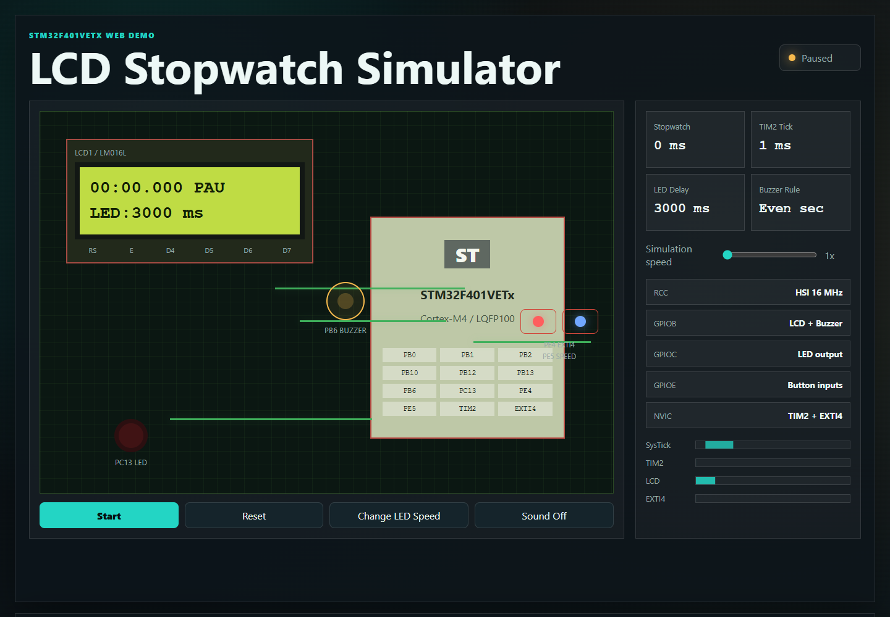
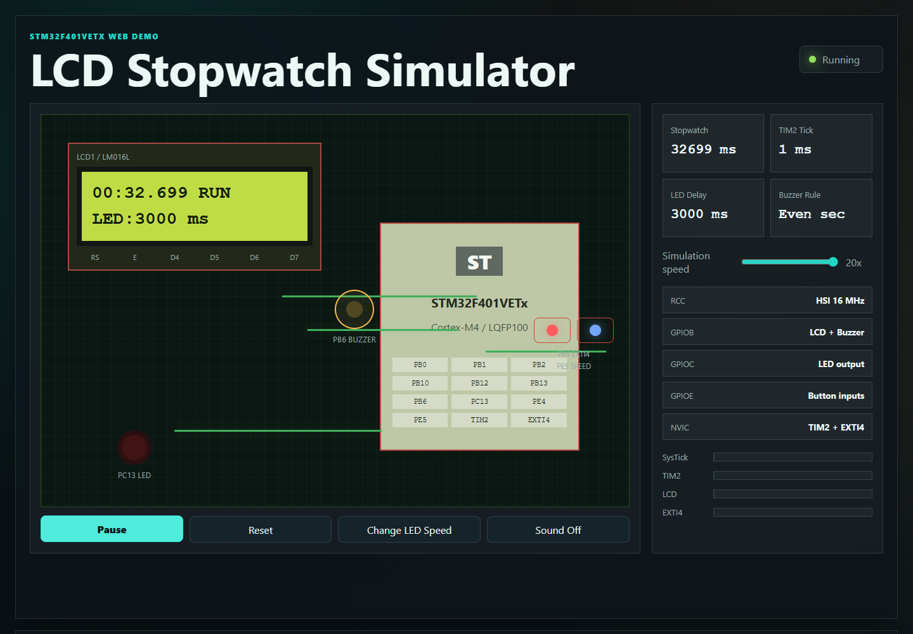

# STM32F401VETx LCD Stopwatch


## Overview

This project implements a stopwatch on an STM32F401VETx microcontroller. The stopwatch time is shown on a 16x2 character LCD. A Start/Pause button controls the stopwatch, a second button changes the LED blink speed, and a buzzer gives a short beep on even-numbered stopwatch seconds.

The final firmware is written with direct register access instead of HAL function calls. STM32CubeMX/STM32CubeIDE were used for project setup and build support. The repository also includes a polished frontend-only web interface in `web_demo/` that presents the hardware project as an interactive product demo.

## Features

- Premium frontend-only interactive web demo
- Stopwatch with millisecond counter
- TIM2 interrupt every 1 ms for stopwatch timing
- Start/Pause button using EXTI4 on PE4
- Speed button on PE5
- LED blink output on PC13
- Buzzer output on PB6
- 16x2 LCD in 4-bit mode
- LCD refresh every 50 ms
- Register-level GPIO, timer, SysTick, EXTI, RCC, and NVIC setup
- Proteus simulation project included

## 🌐 Web Demo

Live demo placeholder:

```text
https://mohadesehesmaeilzadeh.github.io/stm32-lcd-stopwatch/web_demo/
```

Enable GitHub Pages from the repository settings to make this URL active.

This repository includes a premium frontend-only simulator that runs directly in the browser:

```text
web_demo/
  index.html
  styles.css
  script.js
  assets/images/
  scripts/capture-screenshot.js
```

The web demo visualizes the same behavior as the embedded project:

- LCD display with `MM:SS.mmm RUN/PAU`
- Start/Pause and Reset controls
- LED speed button with the same delay sequence used in firmware
- Animated LED and buzzer state
- Optional browser sound for buzzer pulses
- Runtime event log
- SysTick, TIM2, LCD, and EXTI4 activity indicators
- Premium landing-page sections for overview, architecture, features, technologies, how it works, gallery, and GitHub CTA
- Project screenshots from Proteus and STM32CubeMX

### Latest Web Interface Screenshot


### Run Locally

Option 1: open the static file directly:

```text
web_demo/index.html
```

Option 2: run a local static server:

```bash
cd web_demo
python -m http.server 8000
```

Then open:

```text
http://localhost:8000
```

### Automatic Screenshot Update

The README screenshot is stored at:

```text
web_demo/assets/images/screenshot-latest.png
```

The README always links to that same file, so replacing it updates the displayed screenshot automatically.

To regenerate the screenshot after changing the design:

```bash
cd web_demo
npm install
npm run screenshot
```

The script `web_demo/scripts/capture-screenshot.js` opens `web_demo/index.html` with Playwright and overwrites `web_demo/assets/images/screenshot-latest.png`.

### Deploy With GitHub Pages

1. Push the repository to GitHub.
2. Open the repository on GitHub.
3. Go to `Settings -> Pages`.
4. Under `Build and deployment`, choose `Deploy from a branch`.
5. Select branch `main` and folder `/root`.
6. Save the settings.
7. Open:

```text
https://mohadesehesmaeilzadeh.github.io/stm32-lcd-stopwatch/web_demo/
```

Other free hosting options: Vercel, Netlify, and Cloudflare Pages. Because the demo is static HTML/CSS/JavaScript, no backend or database is required.

## Previous Web Demo Screenshots

### Browser Simulator Overview



This screenshot shows the initial browser demo state. The virtual LCD is paused at `00:00.000`, the STM32F401VETx chip is represented in the center of the board, and the control panel shows the same timing concepts used in the firmware: TIM2 tick, LED delay, SysTick activity, GPIO groups, and EXTI4 input.

### Running Browser Simulation



This screenshot shows the web simulator while the stopwatch is running. The LCD changes to `RUN`, the stopwatch counter increases, the status indicator turns green, and the simulation speed slider can be used to observe TIM2/LCD/LED behavior faster than real time. This makes the embedded project easier to explain without opening STM32CubeIDE or Proteus.

## Hardware

| Part | Description |
|---|---|
| Microcontroller | STM32F401VETx |
| Display | 16x2 character LCD, LM016L or compatible |
| Buttons | 2 push buttons |
| LED | 1 LED with current-limiting resistor |
| Buzzer | Active buzzer or speaker model for simulation |
| Potentiometer | 10k for LCD contrast |
| Simulation | Proteus 8 Professional |

## Pin Connections

| Function | STM32 pin | Notes |
|---|---:|---|
| LCD RS | PB0 | Register select |
| LCD E | PB1 | Enable |
| LCD D4 | PB2 | LCD data bit 4 |
| LCD D5 | PB10 | LCD data bit 5 |
| LCD D6 | PB13 | LCD data bit 6 |
| LCD D7 | PB12 | LCD data bit 7 |
| LCD RW | GND | Write-only mode |
| LCD VSS | GND | Ground |
| LCD VDD | +5V | LCD supply in Proteus |
| LCD VEE | Potentiometer wiper | Contrast |
| Start/Pause button | PE4 | Input with pull-up, EXTI4 falling edge |
| Speed button | PE5 | Input with pull-up |
| LED | PC13 | Digital output |
| Buzzer | PB6 | Digital output |

## Architecture

```text
Reset
  -> Clock_Init()       : enable HSI, use 16 MHz system clock
  -> SysTick_Init()     : create helper 1 ms counter
  -> GPIO_Init()        : configure LCD, buttons, LED, buzzer
  -> TIM2_Init()        : configure 1 ms stopwatch interrupt
  -> EXTI4_Init()       : configure Start/Pause button interrupt
  -> LCD_Init()         : initialize LCD in 4-bit mode
  -> main loop
       - poll speed button
       - update LED
       - process buzzer rule
       - refresh LCD every 50 ms

Interrupts:
  SysTick_Handler       : increments sys_ms
  TIM2_IRQHandler       : increments stopwatch_ms when running
  EXTI4_IRQHandler      : toggles Start/Pause with debounce
```

## How It Works

TIM2 is configured to generate an interrupt every 1 ms. When the stopwatch is running, the TIM2 interrupt increments `stopwatch_ms`. The LCD displays the value as:

```text
MM:SS.mmm RUN
```

or:

```text
MM:SS.mmm PAU
```

The PE4 button toggles between running and paused. The PE5 button changes the LED blink period in this sequence:

```text
3000 ms -> 1500 ms -> 750 ms -> 375 ms -> 3000 ms
```

The buzzer turns on for 100 ms when the stopwatch reaches a new even-numbered second while running.

## Project Structure

```text
StopWatch/
  Core/
    Inc/                  Header files
    Src/
      main.c              Main register-level application
      gpio.c              CubeMX-generated GPIO file
      tim.c               CubeMX-generated TIM2 file
      stm32f4xx_it.c      CubeMX interrupt file, selected handlers commented
      system_stm32f4xx.c  CMSIS system file
      syscalls.c          Newlib syscall stubs
      sysmem.c            Heap support
    Startup/
      startup_stm32f401vetx.s
  STM32F401VETX_FLASH.ld  Flash linker script
  STM32F401VETX_RAM.ld    RAM linker script
  StopWatch.ioc           CubeMX configuration
  Debug/                  Build output, usually ignored in Git
Proteus/
  StopWatch.pdsprj        Proteus simulation project
docs/
  PROJECT_REVIEW.md       Detailed review and analysis
  GITHUB_SETUP.md         GitHub setup guide
  images/                 Screenshots used in this README
web_demo/
  index.html              Premium web interface
  styles.css              Web demo styling
  script.js               Interactive simulator logic
  package.json            Screenshot helper dependency/script
  scripts/
    capture-screenshot.js Updates assets/images/screenshot-latest.png
  assets/
    images/               Web, Proteus, and CubeMX screenshots
```

## Final Git Commands

Use this sequence when you are ready to push the current version:

```bash
git status
git add README.md .gitignore web_demo
git add -u index.html styles.css script.js
git commit -m "Add premium web demo interface"
git push origin main
```

## Build Instructions

1. Install STM32CubeIDE.
2. Open STM32CubeIDE.
3. Import the project folder:

```text
File -> Import -> Existing Projects into Workspace
```

4. Select the `StopWatch` folder.
5. Make sure the STM32Cube FW F4 package is installed.
6. Build the project.
7. Use the generated HEX file from the build output.

For Proteus simulation, open `StopWatch.pdsprj`, select the STM32 microcontroller, load `StopWatch.hex`, and set the MCU clock frequency to 16 MHz.

## Simulation Screenshots

### Proteus Schematic Overview


This screenshot shows the complete Proteus schematic before running the simulation. The STM32F401VETx is connected to the 16x2 LCD, two push buttons, an LED with a 330 ohm resistor, a buzzer, a speaker model, reset/boot resistors, power, and ground. It is useful for checking the wiring and the pin connections used by the firmware.

### Running Stopwatch Simulation


This screenshot shows the Proteus simulation while the stopwatch is running. The LCD displays the elapsed time and the current LED blink delay. The Start/Pause and speed buttons are connected on the right side of the microcontroller, and the LED and buzzer outputs show the live behavior of the firmware during simulation.

### STM32CubeMX Pinout Configuration


This screenshot shows the STM32CubeMX pinout view for the STM32F401VETx. It highlights the GPIO pins used by the project: PE4 for the external interrupt button, PE5 for the speed button, PC13 for the LED, PB6 for the buzzer, and the PB pins used for the LCD data/control lines. TIM2 is also enabled for stopwatch timing.

## Important Notes

- The final application code uses direct register access and avoids HAL calls in the runtime logic.
- CubeMX-generated files are still present as project support files.
- If CubeMX regenerates code, check interrupt handlers carefully to avoid duplicate definitions of `SysTick_Handler`, `TIM2_IRQHandler`, and `EXTI4_IRQHandler`.
- For real hardware, drive the buzzer through a transistor if its current is higher than the GPIO pin can safely provide.
- PC13 LED polarity may differ on real development boards.

## Known Limitations

- No reset button is implemented.
- LCD writes are blocking.
- The active source and CubeMX `.ioc` settings should be kept synchronized before long-term maintenance.
- The generated Debug makefile may contain local absolute paths. Regenerate the build files in STM32CubeIDE if building on another computer.

## Credits

Course project for a microcontroller/microprocessor class.

Authors:

- Mohadeseh Esmaeilzade
