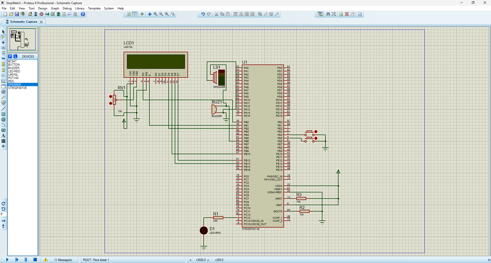
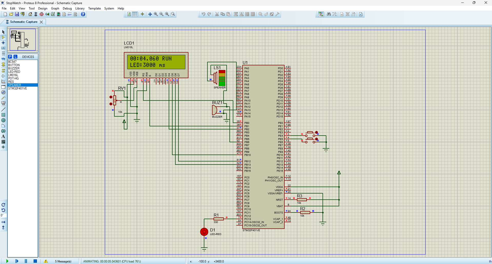
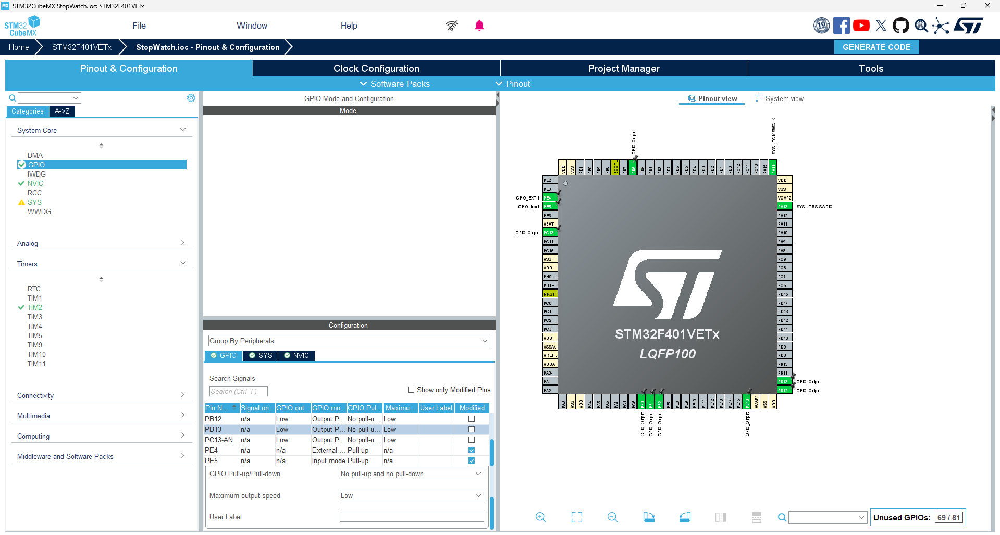
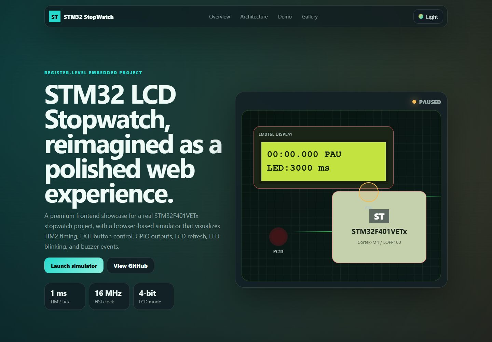

# My STM32 LCD Stopwatch Project


So basically, this is my microcontroller course project: a stopwatch built with an STM32F401VETx, a 16x2 LCD, two buttons, one LED, and a buzzer. It sounds simple at first, like "yeah just count time and show it on LCD", but honestly the timing, interrupts, and LCD wiring made it way more interesting than I expected.

The main idea is that the STM32 counts milliseconds using TIM2, shows the time on the LCD, lets me start/pause it with a button, changes the LED blinking speed with another button, and makes the buzzer beep for a short moment on even-numbered seconds. I also made a frontend web demo for it, because opening Proteus every time just to explain the project is kinda annoying. The web demo is not the real hardware of course, but it makes the idea way easier to understand from the README.

Live demo placeholder:

```text
https://mohadesehesmaeilzadeh.github.io/stm32-lcd-stopwatch/web_demo/
```

## Why I Made This

This project was made for my microcontroller/microprocessor course:

```text
Course: Microcontroller / Microprocessor
Semester / Date: Spring of 2026
Student: Mohadeseh Esmaeilzade
```

I wanted something that was more than the usual LED blink example. Don't get me wrong, blinking an LED is the hello world of embedded systems, but after doing it a few times you start wanting something that feels like an actual device. A stopwatch was a good choice because it needs timers, GPIO, interrupts, display handling, and a little bit of user interaction.

Also, fun fact: the LCD part was more annoying than the timer part. One wrong pin or one bad delay and the display just sits there like nothing happened. Note to self: always check the LCD contrast pin before blaming the code.

## What It Does

When the system starts, the LCD shows the stopwatch time in this format:

```text
MM:SS.mmm PAU
LED:3000 ms
```

`PAU` means the stopwatch is paused. When I press the Start/Pause button, it changes to `RUN` and the milliseconds start counting. The second button changes the LED blink delay through this sequence:

```text
3000 ms -> 1500 ms -> 750 ms -> 375 ms -> 3000 ms
```

The buzzer gives a short pulse when the stopwatch reaches a new even second, like 2 seconds, 4 seconds, 6 seconds and so on. It's not supposed to play music or anything fancy, just a simple "hey, something happened" beep.

## How It Works, Without Making It Sound Too Scary

The STM32 uses the internal HSI clock at 16 MHz. TIM2 is configured to create a 1 ms interrupt. Every time that interrupt happens, the code checks if the stopwatch is running. If yes, it increments `stopwatch_ms`. If not, it leaves the counter alone.

The PE4 button is connected as an external interrupt using EXTI4. That button toggles the stopwatch between running and paused. The PE5 button is polled in the main loop and changes the LED delay. I know polling is not always the prettiest method, but for this button it was simple and worked fine.

The LCD is connected in 4-bit mode, so it uses fewer pins than 8-bit mode. The main loop refreshes the LCD about every 50 ms. The LED is on PC13 and the buzzer is on PB6. Most of the runtime logic is written with direct register access instead of using HAL functions, because the point of this project was to understand what the microcontroller is actually doing.

Here is the rough architecture:

```text
Buttons PE4 / PE5
       |
       v
STM32F401VETx
  - RCC clock setup
  - GPIO setup
  - TIM2 1 ms interrupt
  - EXTI4 start/pause interrupt
  - SysTick helper delay
       |
       v
LCD display + PC13 LED + PB6 buzzer
```

## Pins I Used

| Function | STM32 Pin | Small note |
|---|---:|---|
| LCD RS | PB0 | LCD register select |
| LCD E | PB1 | LCD enable |
| LCD D4 | PB2 | 4-bit LCD data |
| LCD D5 | PB10 | 4-bit LCD data |
| LCD D6 | PB13 | 4-bit LCD data |
| LCD D7 | PB12 | 4-bit LCD data |
| LCD RW | GND | Write-only mode |
| Start/Pause button | PE4 | EXTI4 input with pull-up |
| Speed button | PE5 | Input with pull-up |
| LED | PC13 | Digital output |
| Buzzer | PB6 | Digital output |

## The Code And Folders

The important firmware file is:

```text
StopWatch/Core/Src/main.c
```

That is where the actual stopwatch behavior lives: clock setup, GPIO setup, LCD functions, TIM2 setup, EXTI4 setup, button handling, LED blinking, buzzer logic, and LCD formatting.

Some other files are generated or used by STM32CubeIDE, but they still matter:

```text
StopWatch/Core/Inc/        Header files
StopWatch/Core/Src/        C source files
StopWatch/Core/Startup/    Startup assembly file
StopWatch/StopWatch.ioc    STM32CubeMX configuration
Proteus/StopWatch.pdsprj   Proteus simulation project
release/StopWatch.hex      Built firmware file for simulation
docs/                      Extra review and setup notes
web_demo/                  Frontend web demo
```

The CubeMX-generated files are kept because the project still needs them for building properly in STM32CubeIDE. The custom logic is mainly in `main.c`.

## Proteus Simulation

The Proteus project is included here:

```text
Proteus/StopWatch.pdsprj
```

To run it, open the Proteus file, load the HEX file into the STM32 model, and make sure the MCU clock is set to 16 MHz. The LCD, LED, buzzer, and buttons are all wired in the schematic.

### Proteus schematic



### Running simulation



### CubeMX pinout



## Web Demo

I also added a web version of the project inside `web_demo/`. It doesn't connect to the real STM32, it just simulates the behavior visually in the browser. No backend. No database. Just HTML, CSS, and JavaScript. I wanted it to feel more like a small product page than a plain school-project folder, because the embedded part is easier to explain when people can click something and see the logic moving.

The demo has a virtual LCD, Start/Pause and Reset buttons, LED speed control, buzzer state, event log, timing indicators, dark/light mode, and screenshots from the real Proteus/CubeMX setup. The cool part is that it mirrors the same basic behavior as the STM32 firmware: the LCD switches between `RUN` and `PAU`, the LED delay changes through the same values, and the buzzer indicator reacts when the simulated stopwatch reaches even seconds.

The web demo is useful for three things:

```text
1. Showing the project quickly without STM32CubeIDE or Proteus
2. Explaining the flow between timer, buttons, LCD, LED, and buzzer
3. Making the GitHub repository look more complete and easier to grade/read
```



Inside the demo folder, the files are pretty straightforward:

```text
web_demo/index.html     Main page layout
web_demo/styles.css     Visual design, responsive layout, dark/light mode
web_demo/script.js      Stopwatch simulation and UI behavior
web_demo/assets/images  Screenshots used by the page and README
```

Run it locally like this:

```bash
cd web_demo
python -m http.server 8000
```

Then open:

```text
http://localhost:8000
```

If you just want to open it quickly, opening `web_demo/index.html` in a browser also works.

To update the screenshot used in this README:

```bash
cd web_demo
npm install
npm run screenshot
```

That command uses Playwright and updates:

```text
web_demo/assets/images/screenshot-latest.png
```

## Building The STM32 Project

Open STM32CubeIDE, import the `StopWatch` folder as an existing project, and build it. If STM32CubeIDE complains about missing STM32Cube firmware packages, install the STM32Cube FW F4 package first.

The normal flow is:

```text
File -> Import -> Existing Projects into Workspace
Select StopWatch/
Build Project
```

For Proteus, use the generated HEX file. I included a release HEX file already, but if you change the code, rebuild the firmware and load the new HEX into Proteus.

## Things That Were Weird Or Annoying

The LCD timing was probably the most annoying part. Sometimes the code looked right, but the LCD showed nothing. In those moments the problem was usually wiring, contrast, or a delay being too short.

Interrupts were also a bit tricky. If the same handler exists in more than one place, the build can fail or the wrong behavior happens. So if CubeMX regenerates code later, the interrupt handlers should be checked carefully, especially:

```text
SysTick_Handler
TIM2_IRQHandler
EXTI4_IRQHandler
```

Another thing: PC13 can behave differently depending on the actual board, especially because many STM32 boards connect the onboard LED in a different polarity. In Proteus it behaves according to this schematic, but real hardware may need a small adjustment.

## What I Learned

I learned that timers are not just "delay but better". They are basically the heart of this kind of project. Once TIM2 was working correctly, the stopwatch became much easier to manage.

I also got more comfortable with register-level programming. HAL is convenient, but writing to registers makes it clearer what is happening behind the scenes. It's slower to write at first, but honestly it makes the microcontroller feel less like a black box.

If I did this again, I would probably clean up the LCD driver into separate `.c` and `.h` files instead of keeping so much in `main.c`. I would also add a real hardware reset button and maybe use a timer/PWM output for the buzzer instead of just toggling a GPIO.

Long story short: it works, it simulates, and now it even has a web demo. Not bad for a course project.

## Credits

Made for a microcontroller/microprocessor course project.

Author:

```text
Mohadeseh Esmaeilzade
```
